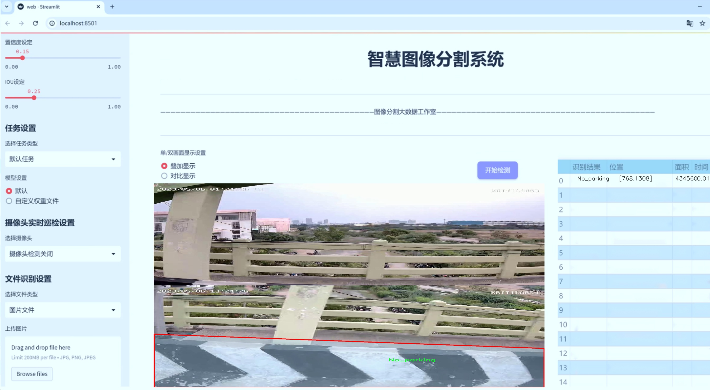
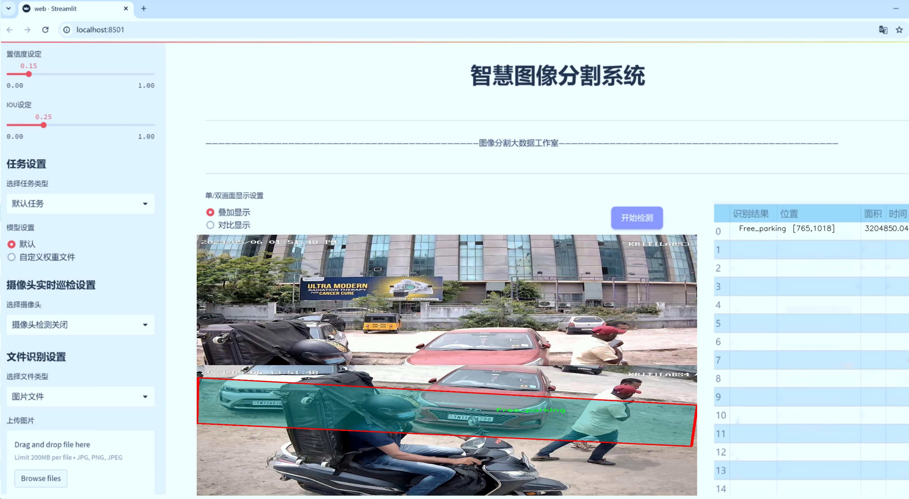
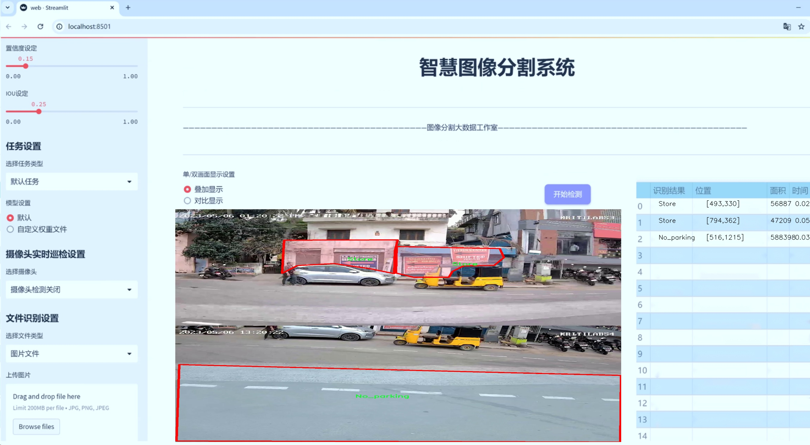
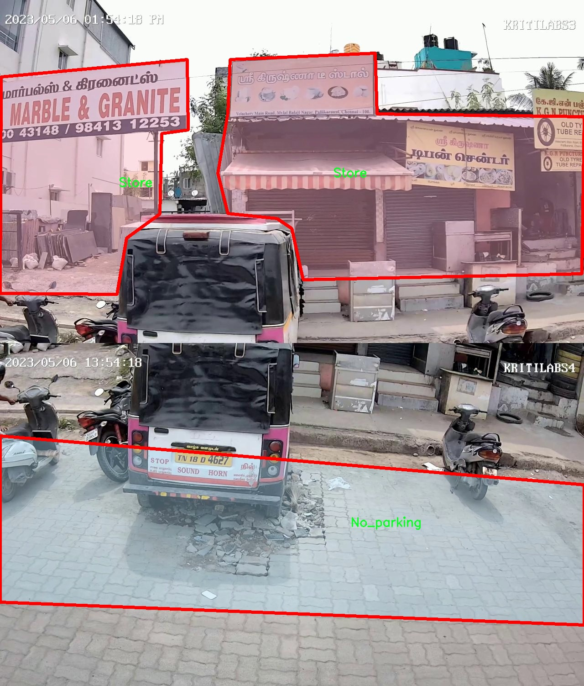
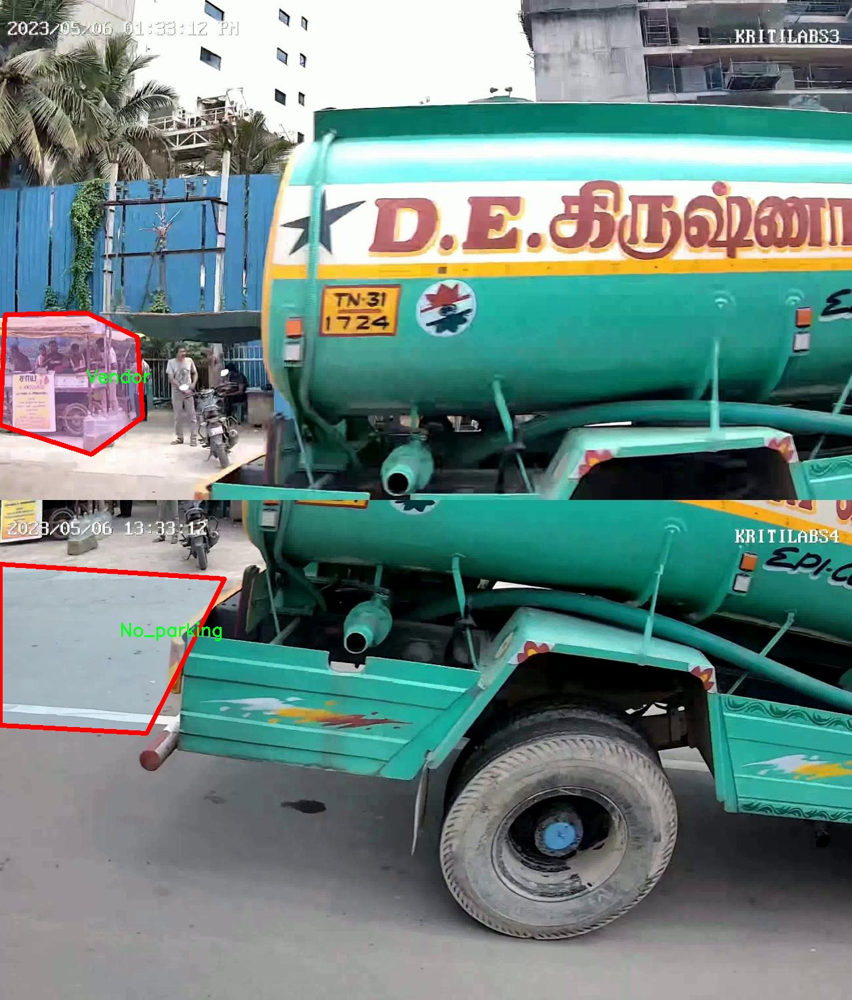
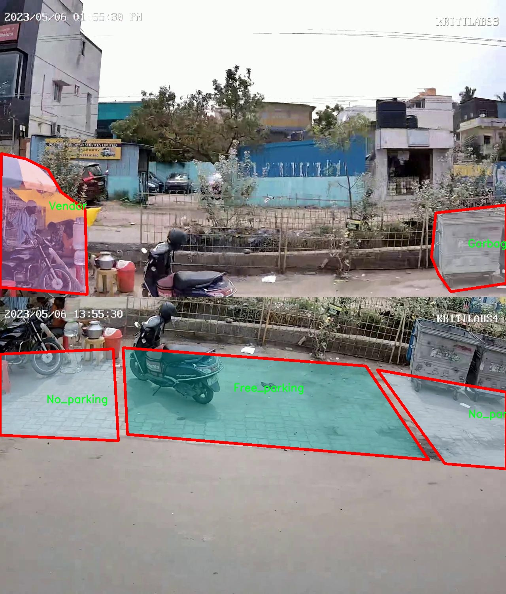
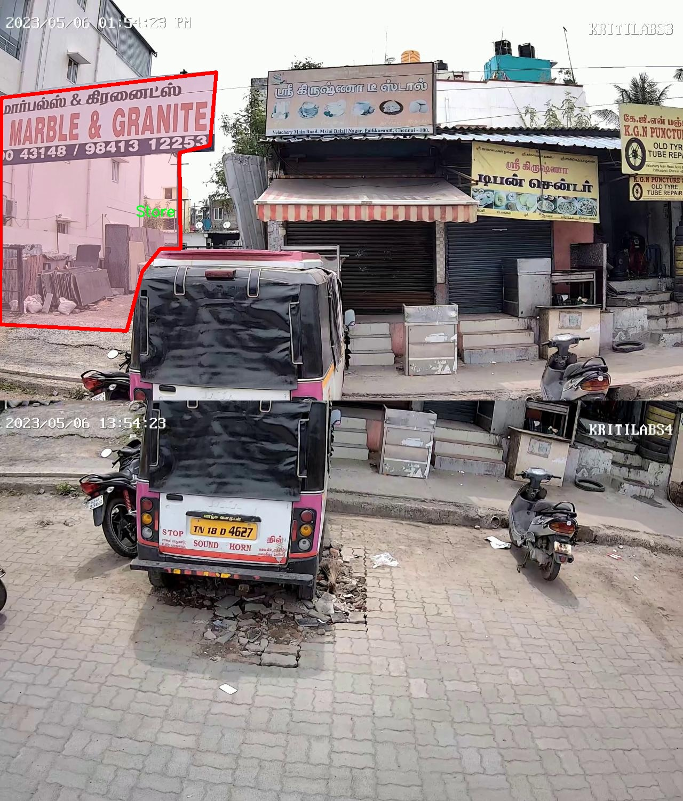
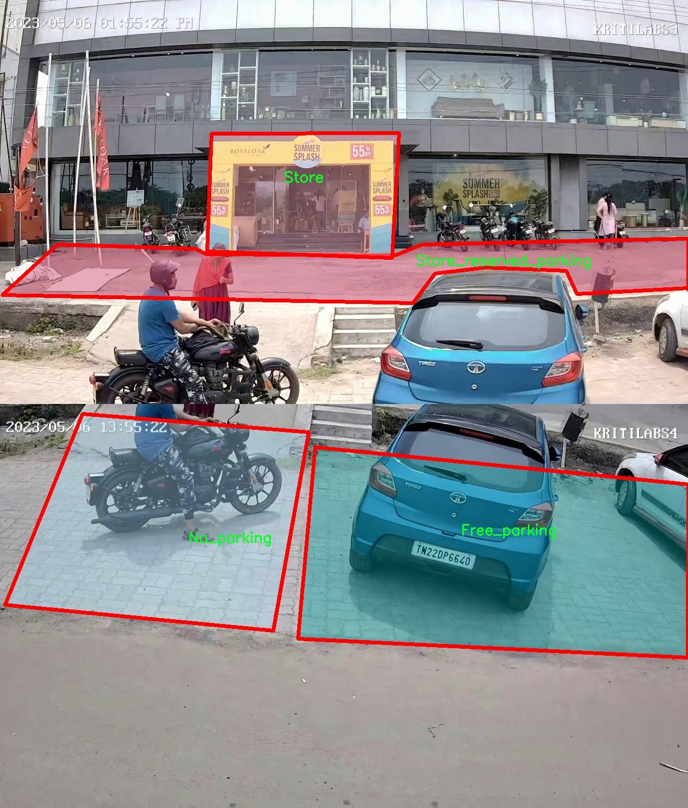

# 路边非标准停车位识别系统源码＆数据集分享
 [yolov8-seg-fasternet-bifpn＆yolov8-seg-p6等50+全套改进创新点发刊_一键训练教程_Web前端展示]

### 1.研究背景与意义

项目参考[ILSVRC ImageNet Large Scale Visual Recognition Challenge](https://gitee.com/YOLOv8_YOLOv11_Segmentation_Studio/projects)

项目来源[AAAI Global Al lnnovation Contest](https://kdocs.cn/l/cszuIiCKVNis)

研究背景与意义

随着城市化进程的加快，城市交通问题日益突出，尤其是停车难问题成为了许多城市管理者亟待解决的难题。非标准停车位的存在不仅影响了城市交通的流畅性，还可能导致交通事故的发生，增加了城市管理的复杂性。因此，开发一个高效的路边非标准停车位识别系统显得尤为重要。近年来，深度学习技术的迅猛发展为图像识别领域带来了新的机遇，尤其是目标检测和实例分割技术的进步，使得自动化识别停车位成为可能。

本研究基于改进的YOLOv8模型，旨在实现对印度道路上非标准停车位的高效识别。YOLO（You Only Look Once）系列模型因其高效的实时检测能力和较高的准确率而广泛应用于各类目标检测任务。通过对YOLOv8模型的改进，我们希望能够提高其在复杂城市环境中对非标准停车位的识别精度和速度，从而为城市交通管理提供有力支持。

本研究所使用的数据集包含1100张图像，涵盖了15个类别的停车相关对象，包括公交站、免费停车位、垃圾箱、禁停标志、物业入口、侧街、商店及其入口、商店保留停车位、寺庙、变压器、公共设施、摊贩和水箱等。这些类别的多样性反映了印度城市道路上停车位的复杂性与多变性，为模型的训练和测试提供了丰富的样本。这一数据集不仅能够帮助我们识别停车位的存在与否，还能提供更为细致的分类信息，有助于进一步分析不同类型停车位的使用情况。

通过对非标准停车位的自动识别，我们能够为城市管理者提供实时的数据支持，帮助他们制定更为科学的停车管理政策。例如，识别出哪些区域存在大量的非法停车行为，进而可以加强该区域的执法力度；或者通过分析免费停车位的使用情况，优化停车资源的配置，提高停车位的利用率。此外，基于识别结果，相关应用程序可以为驾驶员提供实时的停车位信息，缓解停车难的问题，提高城市交通的整体效率。

综上所述，本研究不仅具有重要的理论意义，也具备广泛的实际应用价值。通过改进YOLOv8模型并结合丰富的数据集，我们期望能够为城市交通管理提供新的解决方案，推动智能交通系统的发展，为建设更加智能化、便捷化的城市交通环境贡献力量。

### 2.图片演示







##### 注意：由于此博客编辑较早，上面“2.图片演示”和“3.视频演示”展示的系统图片或者视频可能为老版本，新版本在老版本的基础上升级如下：（实际效果以升级的新版本为准）

  （1）适配了YOLOV8的“目标检测”模型和“实例分割”模型，通过加载相应的权重（.pt）文件即可自适应加载模型。

  （2）支持“图片识别”、“视频识别”、“摄像头实时识别”三种识别模式。

  （3）支持“图片识别”、“视频识别”、“摄像头实时识别”三种识别结果保存导出，解决手动导出（容易卡顿出现爆内存）存在的问题，识别完自动保存结果并导出到tempDir中。

  （4）支持Web前端系统中的标题、背景图等自定义修改，后面提供修改教程。

  另外本项目提供训练的数据集和训练教程,暂不提供权重文件（best.pt）,需要您按照教程进行训练后实现图片演示和Web前端界面演示的效果。

### 3.视频演示

[3.1 视频演示](https://www.bilibili.com/video/BV1Axm5YuE8v/)

### 4.数据集信息展示

##### 4.1 本项目数据集详细数据（类别数＆类别名）

nc: 15
names: ['Bus_stand', 'Free_parking', 'Garbage_bin', 'No_parking', 'Property', 'Property_entrance', 'Side_street', 'Store', 'Store_entrance', 'Store_reserved_parking', 'Temple', 'Transformer', 'Utility_box', 'Vendor', 'Water_tank']


##### 4.2 本项目数据集信息介绍

数据集信息展示

在本研究中，我们使用了名为“Parking Space Identification on Indian Roads”的数据集，以训练和改进YOLOv8-seg模型，旨在实现对路边非标准停车位的高效识别。该数据集专注于印度道路上的停车空间，涵盖了多种类别的停车位和相关物体，为模型的训练提供了丰富的样本和多样化的场景。数据集的类别数量为15，具体类别包括：公交站（Bus_stand）、免费停车位（Free_parking）、垃圾箱（Garbage_bin）、禁止停车区（No_parking）、物业（Property）、物业入口（Property_entrance）、侧街（Side_street）、商店（Store）、商店入口（Store_entrance）、商店保留停车位（Store_reserved_parking）、寺庙（Temple）、变压器（Transformer）、公用设施箱（Utility_box）、小贩（Vendor）和水箱（Water_tank）。

每个类别都代表了在城市环境中常见的特定物体或区域，这些元素在路边停车位的识别中起着至关重要的作用。例如，公交站和寺庙等公共设施的存在可能会影响停车位的可用性，而垃圾箱和公用设施箱则可能占用部分道路空间，影响车辆的停放选择。通过对这些类别的准确识别，模型能够更好地理解周围环境，从而提高停车位识别的准确性和效率。

数据集中的图像样本来源于印度的不同城市和乡镇，涵盖了多种天气条件和光照环境，确保了模型在各种实际场景中的适应性。每个类别的样本数量经过精心设计，以确保模型在训练过程中能够获得均衡的学习机会，避免因某一类别样本过多而导致的偏差。此外，数据集还包含了多种视角和距离的图像，使得模型能够学习到不同情况下的物体特征，进一步增强了其鲁棒性。

在数据集的标注过程中，采用了精确的多边形标注方法，以确保每个类别的边界清晰可辨。这种高质量的标注不仅提高了模型的训练效果，也为后续的推理阶段提供了可靠的基础。随着YOLOv8-seg模型的不断优化，我们期望通过该数据集的训练，提升模型在复杂城市环境中对非标准停车位的识别能力，从而为智能交通系统的发展贡献力量。

总之，“Parking Space Identification on Indian Roads”数据集为本研究提供了坚实的基础，涵盖了丰富的类别和多样的场景，使得我们能够在路边非标准停车位识别的任务中取得显著进展。通过对该数据集的深入分析和利用，我们期待能够推动智能停车技术的发展，改善城市交通管理，提高停车效率，为驾驶者提供更为便捷的停车体验。











### 5.全套项目环境部署视频教程（零基础手把手教学）

[5.1 环境部署教程链接（零基础手把手教学）](https://www.bilibili.com/video/BV1jG4Ve4E9t/?vd_source=bc9aec86d164b67a7004b996143742dc)


[5.2 安装Python虚拟环境创建和依赖库安装视频教程链接（零基础手把手教学）](https://www.bilibili.com/video/BV1nA4VeYEze/?vd_source=bc9aec86d164b67a7004b996143742dc)

### 6.手把手YOLOV8-seg训练视频教程（零基础小白有手就能学会）

[6.1 手把手YOLOV8-seg训练视频教程（零基础小白有手就能学会）](https://www.bilibili.com/video/BV1cA4VeYETe/?vd_source=bc9aec86d164b67a7004b996143742dc)


按照上面的训练视频教程链接加载项目提供的数据集，运行train.py即可开始训练



     Epoch   gpu_mem       box       obj       cls    labels  img_size
     1/200     0G   0.01576   0.01955  0.007536        22      1280: 100%|██████████| 849/849 [14:42<00:00,  1.04s/it]
               Class     Images     Labels          P          R     mAP@.5 mAP@.5:.95: 100%|██████████| 213/213 [01:14<00:00,  2.87it/s]
                 all       3395      17314      0.994      0.957      0.0957      0.0843

     Epoch   gpu_mem       box       obj       cls    labels  img_size
     2/200     0G   0.01578   0.01923  0.007006        22      1280: 100%|██████████| 849/849 [14:44<00:00,  1.04s/it]
               Class     Images     Labels          P          R     mAP@.5 mAP@.5:.95: 100%|██████████| 213/213 [01:12<00:00,  2.95it/s]
                 all       3395      17314      0.996      0.956      0.0957      0.0845

     Epoch   gpu_mem       box       obj       cls    labels  img_size
     3/200     0G   0.01561    0.0191  0.006895        27      1280: 100%|██████████| 849/849 [10:56<00:00,  1.29it/s]
               Class     Images     Labels          P          R     mAP@.5 mAP@.5:.95: 100%|███████   | 187/213 [00:52<00:00,  4.04it/s]
                 all       3395      17314      0.996      0.957      0.0957      0.0845


### 7.50+种全套YOLOV8-seg创新点代码加载调参视频教程（一键加载写好的改进模型的配置文件）

[7.1 50+种全套YOLOV8-seg创新点代码加载调参视频教程（一键加载写好的改进模型的配置文件）](https://www.bilibili.com/video/BV1Hw4VePEXv/?vd_source=bc9aec86d164b67a7004b996143742dc)

### 8.YOLOV8-seg图像分割算法原理

原始YOLOV8-seg算法原理

YOLOv8-seg算法是YOLO系列中的一个重要进展，旨在解决传统目标检测方法在复杂环境下的局限性，尤其是在小目标检测和背景复杂性方面的挑战。与之前的YOLO版本相比，YOLOv8-seg采用了anchor-free的检测方法，这一创新显著提高了检测精度和速度，使得模型在实时应用中表现得更加出色。该算法的核心在于其结构设计与特征提取能力，能够有效处理各种复杂场景下的目标检测任务。

YOLOv8-seg的整体架构主要由四个模块组成：输入端、主干网络、Neck端和输出端。输入端负责对输入图像进行预处理，包括Mosaic数据增强、自适应图像缩放和灰度填充等。这些预处理步骤旨在提高模型对不同输入条件的适应性，增强特征提取的有效性。主干网络则是特征提取的核心，采用了卷积、池化等操作，通过C2f模块和SPPF结构来提取图像的深层特征。C2f模块的引入，替代了传统的C3模块，旨在通过更多的跳层连接和Split操作，提升特征流动性和上下文信息的保留能力，从而增强对小目标的感知。

在Neck端，YOLOv8-seg利用路径聚合网络（PAN）结构，通过上采样和下采样的特征融合，进一步整合不同尺度的特征图。这一设计使得模型能够更好地捕捉到目标的多样性，尤其是在处理小目标时，能够有效减少漏检现象。Neck端的设计不仅提升了特征融合的能力，还增强了模型对复杂背景的适应性，使得YOLOv8-seg在多变的环境中依然能够保持高效的检测性能。

输出端采用了解耦头结构，分别处理分类和回归任务。通过将这两个过程解耦，YOLOv8-seg能够在计算上实现更高的效率，同时提升模型的收敛速度。输出端的设计还引入了Task-Aligned Assigner方法，通过对分类分数和回归分数的加权，优化了正样本的匹配过程，确保了模型在训练过程中的有效性。

YOLOv8-seg的另一个重要创新在于损失函数的设计。与传统的CIoU损失函数不同，YOLOv8-seg采用了MPDIoU损失函数，这一变化旨在提高模型的泛化能力和精确度。MPDIoU损失函数能够更好地处理目标的定位误差，尤其是在复杂背景下，能够有效提升模型对目标的感知能力。

尽管YOLOv8-seg在许多方面表现出色，但在复杂水面环境下，仍然面临着小目标漂浮物特征复杂、背景多样等挑战。这些因素导致了模型在目标定位和感知能力方面的不足。为了解决这些问题，YOLOv8-seg在设计上进行了多项改进。例如，引入了BiFormer双层路由注意力机制，旨在捕获远程依赖关系，从而减轻主干网络下采样过程中的噪声影响。这一机制能够有效保留特征提取过程中更细粒度的上下文信息，使得模型在复杂环境下的表现更加稳健。

此外，为了进一步提升对小目标的检测能力，YOLOv8-seg还添加了一个更小的检测头。这一设计不仅增强了网络对小目标的感知力，还在Neck端引入了GSConv和Slim-neck技术，旨在保持检测精度的同时降低计算量。这些改进使得YOLOv8-seg在面对小目标时，能够更好地应对复杂背景带来的挑战，提升了整体检测性能。

总的来说，YOLOv8-seg算法通过一系列创新的设计和改进，极大地提升了目标检测的精度和速度，尤其是在复杂环境下的表现。其核心思想在于通过高效的特征提取和融合机制，结合先进的损失函数设计，来实现对多样化目标的精准检测。尽管仍存在一些挑战，但YOLOv8-seg无疑为目标检测领域带来了新的思路和方向，推动了计算机视觉技术的进一步发展。


### 9.系统功能展示（检测对象为举例，实际内容以本项目数据集为准）

图9.1.系统支持检测结果表格显示

  图9.2.系统支持置信度和IOU阈值手动调节

  图9.3.系统支持自定义加载权重文件best.pt(需要你通过步骤5中训练获得)

  图9.4.系统支持摄像头实时识别

  图9.5.系统支持图片识别

  图9.6.系统支持视频识别

  图9.7.系统支持识别结果文件自动保存

  图9.8.系统支持Excel导出检测结果数据


### 10.50+种全套YOLOV8-seg创新点原理讲解（非科班也可以轻松写刊发刊，V11版本正在科研待更新）

#### 10.1 由于篇幅限制，每个创新点的具体原理讲解就不一一展开，具体见下列网址中的创新点对应子项目的技术原理博客网址【Blog】：


[10.1 50+种全套YOLOV8-seg创新点原理讲解链接](https://gitee.com/qunmasj/good)

#### 10.2 部分改进模块原理讲解(完整的改进原理见上图和技术博客链接)【如果此小节的图加载失败可以通过CSDN或者Github搜索该博客的标题访问原始博客，原始博客图片显示正常】

### YOLOv8简介

按照官方描述，YOLOv8 是一个 SOTA 模型，它建立在以前 YOLO 版本的成功基础上，并引入了新的功能和改进，以进一步提升性能和灵活性。具体创新包括一个新的骨干网络、一个新的 Ancher-Free 检测头和一个新的损失函数，可以在从 CPU 到 GPU 的各种硬件平台上运行。

不过 ultralytics 并没有直接将开源库命名为 YOLOv8，而是直接使用 ultralytics 这个词，原因是 ultralytics 将这个库定位为算法框架，而非某一个特定算法，一个主要特点是可扩展性。其希望这个库不仅仅能够用于 YOLO 系列模型，而是能够支持非 YOLO 模型以及分类分割姿态估计等各类任务。
总而言之，ultralytics 开源库的两个主要优点是：

融合众多当前 SOTA 技术于一体
未来将支持其他 YOLO 系列以及 YOLO 之外的更多算法


下表为官方在 COCO Val 2017 数据集上测试的 mAP、参数量和 FLOPs 结果。可以看出 YOLOv8 相比 YOLOv5 精度提升非常多，但是 N/S/M 模型相应的参数量和 FLOPs 都增加了不少，从上图也可以看出相比 YOLOV5 大部分模型推理速度变慢了。


额外提一句，现在各个 YOLO 系列改进算法都在 COCO 上面有明显性能提升，但是在自定义数据集上面的泛化性还没有得到广泛验证，至今依然听到不少关于 YOLOv5 泛化性能较优异的说法。对各系列 YOLO 泛化性验证也是 MMYOLO 中一个特别关心和重点发力的方向。

### YOLO-MS简介
实时目标检测，以YOLO系列为例，已在工业领域中找到重要应用，特别是在边缘设备（如无人机和机器人）中。与之前的目标检测器不同，实时目标检测器旨在在速度和准确性之间追求最佳平衡。为了实现这一目标，提出了大量的工作：从第一代DarkNet到CSPNet，再到最近的扩展ELAN，随着性能的快速增长，实时目标检测器的架构经历了巨大的变化。

尽管性能令人印象深刻，但在不同尺度上识别对象仍然是实时目标检测器面临的基本挑战。这促使作者设计了一个强大的编码器架构，用于学习具有表现力的多尺度特征表示。具体而言，作者从两个新的角度考虑为实时目标检测编码多尺度特征：

从局部视角出发，作者设计了一个具有简单而有效的分层特征融合策略的MS-Block。受到Res2Net的启发，作者在MS-Block中引入了多个分支来进行特征提取，但不同的是，作者使用了一个带有深度卷积的 Inverted Bottleneck Block块，以实现对大Kernel的高效利用。

从全局视角出发，作者提出随着网络加深逐渐增加卷积的Kernel-Size。作者在浅层使用小Kernel卷积来更高效地处理高分辨率特征。另一方面，在深层中，作者采用大Kernel卷积来捕捉广泛的信息。

基于以上设计原则，作者呈现了作者的实时目标检测器，称为YOLO-MS。为了评估作者的YOLO-MS的性能，作者在MS COCO数据集上进行了全面的实验。还提供了与其他最先进方法的定量比较，以展示作者方法的强大性能。如图1所示，YOLO-MS在计算性能平衡方面优于其他近期的实时目标检测器。


具体而言，YOLO-MS-XS在MS COCO上获得了43%+的AP得分，仅具有450万个可学习参数和8.7亿个FLOPs。YOLO-MS-S和YOLO-MS分别获得了46%+和51%+的AP，可学习参数分别为810万和2220万。此外，作者的工作还可以作为其他YOLO模型的即插即用模块。通常情况下，作者的方法可以将YOLOv8的AP从37%+显著提高到40%+，甚至还可以使用更少的参数和FLOPs。


#### Multi-Scale Building Block Design
CSP Block是一个基于阶段级梯度路径的网络，平衡了梯度组合和计算成本。它是广泛应用于YOLO系列的基本构建块。已经提出了几种变体，包括YOLOv4和YOLOv5中的原始版本，Scaled YOLOv4中的CSPVoVNet，YOLOv7中的ELAN，以及RTMDet中提出的大Kernel单元。作者在图2(a)和图2(b)中分别展示了原始CSP块和ELAN的结构。


上述实时检测器中被忽视的一个关键方面是如何在基本构建块中编码多尺度特征。其中一个强大的设计原则是Res2Net，它聚合了来自不同层次的特征以增强多尺度表示。然而，这一原则并没有充分探索大Kernel卷积的作用，而大Kernel卷积已经在基于CNN的视觉识别任务模型中证明有效。将大Kernel卷积纳入Res2Net的主要障碍在于它们引入的计算开销，因为构建块采用了标准卷积。在作者的方法中，作者提出用 Inverted Bottleneck Block替代标准的3 × 3卷积，以享受大Kernel卷积的好处。

基于前面的分析，作者提出了一个带有分层特征融合策略的全新Block，称为MS-Block，以增强实时目标检测器在提取多尺度特征时的能力，同时保持快速的推理速度。

MS-Block的具体结构如图2(c)所示。假设是输入特征。通过1×1卷积的转换后，X的通道维度增加到n*C。然后，作者将X分割成n个不同的组，表示为，其中。为了降低计算成本，作者选择n为3。

注意，除了之外，每个其他组都经过一个 Inverted Bottleneck Block层，用表示，其中k表示Kernel-Size，以获得。的数学表示如下：


根据这个公式，该博客的作者不将 Inverted Bottleneck Block层连接，使其作为跨阶段连接，并保留来自前面层的信息。最后，作者将所有分割连接在一起，并应用1×1卷积来在所有分割之间进行交互，每个分割都编码不同尺度的特征。当网络加深时，这个1×1卷积也用于调整通道数。

#### Heterogeneous Kernel Selection Protocol
除了构建块的设计外，作者还从宏观角度探讨了卷积的使用。之前的实时目标检测器在不同的编码器阶段采用了同质卷积（即具有相同Kernel-Size的卷积），但作者认为这不是提取多尺度语义信息的最佳选项。

在金字塔结构中，从检测器的浅阶段提取的高分辨率特征通常用于捕捉细粒度语义，将用于检测小目标。相反，来自网络较深阶段的低分辨率特征用于捕捉高级语义，将用于检测大目标。如果作者在所有阶段都采用统一的小Kernel卷积，深阶段的有效感受野（ERF）将受到限制，影响大目标的性能。在每个阶段中引入大Kernel卷积可以帮助解决这个问题。然而，具有大的ERF的大Kernel可以编码更广泛的区域，这增加了在小目标外部包含噪声信息的概率，并且降低了推理速度。

在这项工作中，作者建议在不同阶段中采用异构卷积，以帮助捕获更丰富的多尺度特征。具体来说，在编码器的第一个阶段中，作者采用最小Kernel卷积，而最大Kernel卷积位于最后一个阶段。随后，作者逐步增加中间阶段的Kernel-Size，使其与特征分辨率的增加保持一致。这种策略允许提取细粒度和粗粒度的语义信息，增强了编码器的多尺度特征表示能力。

正如图所示，作者将k的值分别分配给编码器中的浅阶段到深阶段，取值为3、5、7和9。作者将其称为异构Kernel选择（HKS）协议。


作者的HKS协议能够在深层中扩大感受野，而不会对浅层产生任何其他影响。此外，HKS不仅有助于编码更丰富的多尺度特征，还确保了高效的推理。

如表1所示，将大Kernel卷积应用于高分辨率特征会产生较高的计算开销。然而，作者的HKS协议在低分辨率特征上采用大Kernel卷积，从而与仅使用大Kernel卷积相比，大大降低了计算成本。


在实践中，作者经验性地发现，采用HKS协议的YOLO-MS的推理速度几乎与仅使用深度可分离的3 × 3卷积相同。

#### Architecture
如图所示，作者模型的Backbone由4个阶段组成，每个阶段后面跟随1个步长为2的3 × 3卷积进行下采样。在第3个阶段后，作者添加了1个SPP块，与RTMDet中一样。在作者的编码器上，作者使用PAFPN作为Neck来构建特征金字塔[31, 35]。它融合了从Backbone不同阶段提取的多尺度特征。Neck中使用的基本构建块也是作者的MS-Block，在其中使用3 × 3深度可分离卷积进行快速推理。

此外，为了在速度和准确性之间取得更好的平衡，作者将Backbone中多级特征的通道深度减半。作者提供了3个不同尺度的YOLO-MS变体，即YOLO-MS-XS、YOLO-MS-S和YOLO-MS。不同尺度的YOLO-MS的详细配置列在表2中。对于YOLO-MS的其他部分，作者将其保持与RTMDet相同。


### 11.项目核心源码讲解（再也不用担心看不懂代码逻辑）

#### 11.1 ui.py

以下是经过精简和注释的核心代码：

```python
import sys
import subprocess

def run_script(script_path):
    """
    使用当前 Python 环境运行指定的脚本。

    Args:
        script_path (str): 要运行的脚本路径
    """
    # 获取当前 Python 解释器的路径
    python_path = sys.executable

    # 构建运行命令，使用 streamlit 运行指定的脚本
    command = f'"{python_path}" -m streamlit run "{script_path}"'

    # 执行命令并等待其完成
    result = subprocess.run(command, shell=True)
    
    # 检查命令执行结果，如果返回码不为0，则表示出错
    if result.returncode != 0:
        print("脚本运行出错。")

# 程序入口
if __name__ == "__main__":
    # 指定要运行的脚本路径
    script_path = "web.py"  # 假设脚本在当前目录下

    # 调用函数运行脚本
    run_script(script_path)
```

### 代码注释说明：
1. **导入模块**：
   - `sys`：用于获取当前 Python 解释器的路径。
   - `subprocess`：用于执行外部命令。

2. **`run_script` 函数**：
   - 接受一个参数 `script_path`，表示要运行的 Python 脚本的路径。
   - 使用 `sys.executable` 获取当前 Python 解释器的路径。
   - 构建命令字符串，使用 `streamlit` 运行指定的脚本。
   - 使用 `subprocess.run` 执行命令，并等待其完成。
   - 检查命令的返回码，如果不为0，表示脚本运行出错，打印错误信息。

3. **程序入口**：
   - 在 `__main__` 块中，指定要运行的脚本路径（这里假设脚本在当前目录下）。
   - 调用 `run_script` 函数来执行指定的脚本。

这个程序文件名为 `ui.py`，其主要功能是通过当前的 Python 环境运行一个指定的脚本，具体是一个名为 `web.py` 的文件。程序的实现依赖于几个标准库和一个自定义的模块 `QtFusion.path`。

首先，程序导入了必要的模块，包括 `sys`、`os` 和 `subprocess`。`sys` 模块用于访问与 Python 解释器交互的变量和函数，`os` 模块提供了与操作系统交互的功能，而 `subprocess` 模块则用于生成新的进程、连接到它们的输入/输出/错误管道，并获取它们的返回码。

接下来，程序定义了一个名为 `run_script` 的函数，该函数接受一个参数 `script_path`，表示要运行的脚本的路径。在函数内部，首先获取当前 Python 解释器的路径，这通过 `sys.executable` 实现。然后，构建一个命令字符串，该命令使用当前的 Python 解释器和 `streamlit` 模块来运行指定的脚本。`streamlit` 是一个用于构建数据应用的流行库。

构建完命令后，程序使用 `subprocess.run` 方法执行这个命令。`shell=True` 参数表示命令将在一个新的 shell 中执行。执行完命令后，程序检查返回码，如果返回码不为零，说明脚本运行过程中出现了错误，此时会打印出“脚本运行出错”的提示信息。

在文件的最后部分，程序通过 `if __name__ == "__main__":` 判断是否是直接运行该脚本。如果是，程序会调用 `abs_path` 函数来获取 `web.py` 的绝对路径，并将其传递给 `run_script` 函数，从而启动该脚本。

总体来看，这个程序的主要目的是为了方便地运行一个 Streamlit 应用脚本，确保使用的是当前的 Python 环境，并能够处理可能出现的错误。

#### 11.2 ultralytics\models\fastsam\prompt.py

以下是代码中最核心的部分，并附上详细的中文注释：

```python
import os
import numpy as np
import torch
from PIL import Image
import cv2
from ultralytics.utils import TQDM

class FastSAMPrompt:
    """
    Fast Segment Anything Model类，用于图像注释和可视化。

    属性:
        device (str): 计算设备（'cuda'或'cpu'）。
        results: 目标检测或分割结果。
        source: 源图像或图像路径。
        clip: 用于线性分配的CLIP模型。
    """

    def __init__(self, source, results, device='cuda') -> None:
        """初始化FastSAMPrompt，设置源图像、结果和设备，并导入CLIP模型。"""
        self.device = device
        self.results = results
        self.source = source

        # 导入并分配CLIP模型
        try:
            import clip  # 用于线性分配
        except ImportError:
            from ultralytics.utils.checks import check_requirements
            check_requirements('git+https://github.com/openai/CLIP.git')
            import clip
        self.clip = clip

    @staticmethod
    def _format_results(result, filter=0):
        """将检测结果格式化为包含ID、分割、边界框、得分和面积的注释列表。"""
        annotations = []
        n = len(result.masks.data) if result.masks is not None else 0
        for i in range(n):
            mask = result.masks.data[i] == 1.0
            if torch.sum(mask) >= filter:
                annotation = {
                    'id': i,
                    'segmentation': mask.cpu().numpy(),
                    'bbox': result.boxes.data[i],
                    'score': result.boxes.conf[i]}
                annotation['area'] = annotation['segmentation'].sum()
                annotations.append(annotation)
        return annotations

    def plot(self, annotations, output):
        """
        在图像上绘制注释、边界框和点，并保存输出。

        参数:
            annotations (list): 要绘制的注释。
            output (str or Path): 保存绘图的输出目录。
        """
        pbar = TQDM(annotations, total=len(annotations))
        for ann in pbar:
            result_name = os.path.basename(ann.path)
            image = ann.orig_img[..., ::-1]  # BGR转RGB
            plt.figure(figsize=(image.shape[1] / 100, image.shape[0] / 100))
            plt.imshow(image)

            if ann.masks is not None:
                masks = ann.masks.data
                for mask in masks:
                    mask = mask.astype(np.uint8)
                    plt.imshow(mask, alpha=0.5)  # 显示掩码

            # 保存图像
            save_path = os.path.join(output, result_name)
            plt.axis('off')
            plt.savefig(save_path, bbox_inches='tight', pad_inches=0, transparent=True)
            plt.close()
            pbar.set_description(f'Saving {result_name} to {save_path}')

    @torch.no_grad()
    def retrieve(self, model, preprocess, elements, search_text: str, device) -> int:
        """处理图像和文本，计算相似度，并返回softmax得分。"""
        preprocessed_images = [preprocess(image).to(device) for image in elements]
        tokenized_text = self.clip.tokenize([search_text]).to(device)
        stacked_images = torch.stack(preprocessed_images)
        image_features = model.encode_image(stacked_images)
        text_features = model.encode_text(tokenized_text)
        image_features /= image_features.norm(dim=-1, keepdim=True)
        text_features /= text_features.norm(dim=-1, keepdim=True)
        probs = 100.0 * image_features @ text_features.T
        return probs[:, 0].softmax(dim=0)

    def everything_prompt(self):
        """返回类中之前处理的结果。"""
        return self.results
```

### 代码核心部分说明：

1. **类定义**：`FastSAMPrompt`类用于处理图像分割和注释，包含多个方法来实现不同的功能。

2. **初始化方法**：`__init__`方法初始化类的属性，包括源图像、结果和计算设备，并导入CLIP模型。

3. **格式化结果**：`_format_results`方法将模型的输出结果格式化为易于处理的注释列表，包含每个分割的ID、掩码、边界框、得分和面积。

4. **绘图方法**：`plot`方法用于在图像上绘制分割掩码和边界框，并将结果保存到指定的输出目录。

5. **检索方法**：`retrieve`方法用于处理图像和文本，计算它们之间的相似度，并返回softmax得分，用于后续的处理。

6. **获取所有结果**：`everything_prompt`方法返回类中处理的所有结果，便于后续使用。

这些方法共同构成了图像分割和注释的核心功能。

这个程序文件是一个用于图像注释和可视化的类，名为 `FastSAMPrompt`，它是基于 Ultralytics YOLO 框架的。该类主要用于处理图像分割和目标检测的结果，并提供多种可视化和交互功能。

在类的初始化方法中，用户可以指定源图像、检测结果和计算设备（如 CPU 或 GPU）。类内部会尝试导入 CLIP 模型，用于后续的线性分配。

该类包含多个静态方法和实例方法。静态方法主要用于处理图像和结果的格式化。例如，`_segment_image` 方法根据给定的边界框从图像中提取区域，`_format_results` 方法将检测结果格式化为包含 ID、分割掩码、边界框、置信度和面积的注释列表，`_get_bbox_from_mask` 方法则通过对掩码进行形态学变换来获取边界框。

`plot` 方法用于在图像上绘制注释、边界框和点，并将结果保存到指定的输出目录。该方法支持多种参数配置，如是否使用随机颜色、是否应用形态学变换等。

`fast_show_mask` 方法用于快速显示掩码注释，它可以在给定的 matplotlib 轴上绘制掩码，并可选地绘制边界框和点。

`retrieve` 方法用于处理图像和文本，通过计算相似度来返回软最大分数，主要用于与 CLIP 模型的交互。

此外，类中还有多个用于处理用户输入的提示方法，如 `box_prompt`、`point_prompt` 和 `text_prompt`。这些方法允许用户通过边界框、点或文本提示来调整和更新检测结果。

最后，`everything_prompt` 方法返回类中处理后的结果，方便用户获取最终的分割和检测结果。

整体而言，这个类提供了一整套用于图像分割和注释的工具，结合了深度学习模型的推理能力和用户交互的灵活性，适用于各种计算机视觉任务。

#### 11.3 ultralytics\trackers\__init__.py

以下是代码中最核心的部分，并附上详细的中文注释：

```python
# 导入所需的跟踪器类
from .bot_sort import BOTSORT  # 导入BOTSORT类，用于目标跟踪
from .byte_tracker import BYTETracker  # 导入BYTETracker类，用于另一种目标跟踪方法
from .track import register_tracker  # 导入注册跟踪器的函数

# 定义可供外部使用的模块成员
__all__ = 'register_tracker', 'BOTSORT', 'BYTETracker'  # 允许更简单的导入方式
```

### 注释说明：
1. **导入部分**：
   - `from .bot_sort import BOTSORT`：从当前包中导入`BOTSORT`类，这个类实现了一种目标跟踪算法。
   - `from .byte_tracker import BYTETracker`：从当前包中导入`BYTETracker`类，提供另一种目标跟踪的实现。
   - `from .track import register_tracker`：从当前包中导入`register_tracker`函数，用于注册不同的跟踪器。

2. **`__all__` 变量**：
   - `__all__`是一个特殊变量，用于定义当使用`from module import *`时，哪些成员会被导入。这里定义了`register_tracker`、`BOTSORT`和`BYTETracker`，使得外部用户可以方便地使用这些功能。

这个程序文件是Ultralytics YOLO项目中的一个初始化文件，位于`ultralytics/trackers`目录下。文件的主要功能是导入和注册跟踪器类，以便在其他模块中可以方便地使用。

首先，文件顶部的注释表明这是Ultralytics YOLO项目的一部分，并且该项目遵循AGPL-3.0许可证。这种许可证通常用于开源软件，允许用户自由使用、修改和分发软件，但要求在分发时保持相同的许可证。

接下来，文件通过相对导入的方式引入了三个组件：`BOTSORT`、`BYTETracker`和`register_tracker`。`BOTSORT`和`BYTETracker`是具体的跟踪器实现，可能用于目标跟踪任务，而`register_tracker`则是一个用于注册跟踪器的函数，可能用于将不同的跟踪器添加到系统中，以便后续使用。

最后，`__all__`变量定义了一个公共接口，列出了可以被外部模块导入的名称。在这里，`__all__`包含了`register_tracker`、`BOTSORT`和`BYTETracker`，这意味着当其他模块使用`from ultralytics.trackers import *`时，只会导入这三个名称。这种做法有助于控制模块的公共接口，避免不必要的名称污染。

总体来说，这个文件的主要作用是组织和管理跟踪器的导入，使得在其他部分的代码中使用这些跟踪器变得更加简洁和清晰。

#### 11.4 train.py

以下是经过简化并添加详细中文注释的核心代码部分：

```python
import os
import torch
import yaml
from ultralytics import YOLO  # 导入YOLO模型库

if __name__ == '__main__':  # 确保该模块被直接运行时才执行以下代码
    # 设置训练参数
    workers = 1  # 数据加载的工作进程数
    batch = 8  # 每个批次的样本数量
    device = "0" if torch.cuda.is_available() else "cpu"  # 判断是否使用GPU

    # 获取数据集配置文件的绝对路径
    data_path = abs_path(f'datasets/data/data.yaml', path_type='current')

    # 读取YAML文件，保持原有顺序
    with open(data_path, 'r') as file:
        data = yaml.load(file, Loader=yaml.FullLoader)

    # 修改数据集路径
    if 'train' in data and 'val' in data and 'test' in data:
        directory_path = os.path.dirname(data_path.replace(os.sep, '/'))  # 获取目录路径
        data['train'] = directory_path + '/train'  # 设置训练集路径
        data['val'] = directory_path + '/val'      # 设置验证集路径
        data['test'] = directory_path + '/test'    # 设置测试集路径

        # 将修改后的数据写回YAML文件
        with open(data_path, 'w') as file:
            yaml.safe_dump(data, file, sort_keys=False)

    # 加载YOLO模型配置文件和预训练权重
    model = YOLO(r"C:\codeseg\codenew\50+种YOLOv8算法改进源码大全和调试加载训练教程（非必要）\改进YOLOv8模型配置文件\yolov8-seg-C2f-Faster.yaml").load("./weights/yolov8s-seg.pt")

    # 开始训练模型
    results = model.train(
        data=data_path,  # 指定训练数据的配置文件路径
        device=device,    # 指定使用的设备（GPU或CPU）
        workers=workers,  # 指定数据加载的工作进程数
        imgsz=640,        # 指定输入图像的大小为640x640
        epochs=100,       # 指定训练的轮数为100
        batch=batch,      # 指定每个批次的大小
    )
```

### 代码注释说明：
1. **导入必要的库**：导入了操作系统、PyTorch、YAML处理库和YOLO模型库。
2. **设置训练参数**：定义了数据加载的工作进程数、批次大小和设备选择（GPU或CPU）。
3. **获取数据集配置文件路径**：使用`abs_path`函数获取数据集的YAML配置文件的绝对路径。
4. **读取和修改YAML文件**：读取YAML文件，更新训练、验证和测试集的路径，并将修改后的内容写回文件。
5. **加载YOLO模型**：根据指定的配置文件和预训练权重加载YOLO模型。
6. **训练模型**：调用`train`方法开始训练，传入数据路径、设备、工作进程数、图像大小、训练轮数和批次大小等参数。

该程序文件 `train.py` 是一个用于训练 YOLO（You Only Look Once）模型的脚本。程序首先导入了必要的库，包括操作系统处理库 `os`、深度学习框架 `torch`、YAML 文件处理库 `yaml`、YOLO 模型库 `ultralytics` 和用于图形界面的 `matplotlib`。接下来，程序确保只有在直接运行该模块时才会执行以下代码。

在主程序中，首先设置了一些训练参数，包括工作进程数 `workers` 和批次大小 `batch`。批次大小可以根据计算机的显存和内存进行调整，如果出现显存不足的情况，可以适当降低该值。接着，程序检测是否有可用的 GPU，如果有则将设备设置为 "0"（即使用第一个 GPU），否则使用 CPU。

程序接着定义了数据集配置文件的路径，使用 `abs_path` 函数获取该 YAML 文件的绝对路径。随后，将路径中的分隔符统一替换为 Unix 风格的斜杠，以便于后续处理。通过读取 YAML 文件，程序获取数据集的相关信息，并修改其中的 `train`、`val` 和 `test` 项目，将它们的路径更新为当前目录下的相应子目录。

在修改完 YAML 文件后，程序将更新后的数据写回到原文件中。此时，程序提醒用户注意不同模型对设备的要求，建议在遇到问题时尝试其他模型配置文件。

接下来，程序加载指定的 YOLO 模型配置文件，并使用预训练的权重文件进行初始化。然后，调用 `model.train` 方法开始训练模型。在训练过程中，程序指定了数据配置文件的路径、设备、工作进程数、输入图像的大小（640x640）、训练的轮数（100个 epoch）以及每个批次的大小（8）。

总的来说，该脚本实现了 YOLO 模型的训练过程，包括数据准备、模型加载和训练参数设置等步骤。

#### 11.5 ultralytics\hub\utils.py

以下是经过简化和注释的核心代码部分：

```python
import os
import platform
import random
import sys
import threading
import time
from pathlib import Path
import requests
from ultralytics.utils import (ENVIRONMENT, LOGGER, ONLINE, RANK, SETTINGS, TESTS_RUNNING, TQDM, TryExcept, __version__,
                               colorstr, get_git_origin_url, is_colab, is_git_dir, is_pip_package)
from ultralytics.utils.downloads import GITHUB_ASSETS_NAMES

# 定义一个用于发送匿名事件分析的类
class Events:
    """
    用于收集匿名事件分析的类。事件分析在设置中 sync=True 时启用，sync=False 时禁用。
    """

    # 事件发送的 URL
    url = 'https://www.google-analytics.com/mp/collect?measurement_id=G-X8NCJYTQXM&api_secret=QLQrATrNSwGRFRLE-cbHJw'

    def __init__(self):
        """初始化 Events 对象，设置默认值。"""
        self.events = []  # 事件列表
        self.rate_limit = 60.0  # 事件发送的速率限制（秒）
        self.t = 0.0  # 速率限制计时器（秒）
        # 存储环境元数据
        self.metadata = {
            'cli': Path(sys.argv[0]).name == 'yolo',  # 判断是否为 yolo 命令行
            'install': 'git' if is_git_dir() else 'pip' if is_pip_package() else 'other',  # 安装方式
            'python': '.'.join(platform.python_version_tuple()[:2]),  # Python 版本
            'version': __version__,  # 当前版本
            'env': ENVIRONMENT,  # 环境信息
            'session_id': round(random.random() * 1E15),  # 随机会话 ID
            'engagement_time_msec': 1000  # 参与时间（毫秒）
        }
        # 根据条件判断是否启用事件收集
        self.enabled = (
            SETTINGS['sync'] and 
            RANK in (-1, 0) and 
            not TESTS_RUNNING and 
            ONLINE and 
            (is_pip_package() or get_git_origin_url() == 'https://github.com/ultralytics/ultralytics.git')
        )

    def __call__(self, cfg):
        """
        尝试将新事件添加到事件列表，并在达到速率限制时发送事件。

        Args:
            cfg (IterableSimpleNamespace): 包含模式和任务信息的配置对象。
        """
        if not self.enabled:
            # 如果事件收集被禁用，则不执行任何操作
            return

        # 尝试将事件添加到列表中
        if len(self.events) < 25:  # 事件列表限制为 25 个事件
            params = {
                **self.metadata, 'task': cfg.task,
                'model': cfg.model if cfg.model in GITHUB_ASSETS_NAMES else 'custom'
            }
            if cfg.mode == 'export':
                params['format'] = cfg.format  # 如果模式为导出，添加格式参数
            self.events.append({'name': cfg.mode, 'params': params})

        # 检查速率限制
        t = time.time()
        if (t - self.t) < self.rate_limit:
            # 如果时间在速率限制内，则等待发送
            return

        # 超过速率限制，立即发送事件
        data = {'client_id': SETTINGS['uuid'], 'events': self.events}  # 客户端 ID 和事件列表

        # 发送 POST 请求
        smart_request('post', self.url, json=data, retry=0, verbose=False)

        # 重置事件列表和速率限制计时器
        self.events = []
        self.t = t

# 创建 Events 实例
events = Events()
```

### 代码说明：
1. **Events 类**：用于收集和发送匿名事件分析。它包含事件的元数据和发送事件的逻辑。
2. **初始化方法**：设置事件列表、速率限制、元数据和是否启用事件收集的条件。
3. **__call__ 方法**：允许实例像函数一样被调用，尝试添加事件并在达到速率限制时发送事件。
4. **速率限制**：通过时间戳控制事件发送频率，避免过于频繁的请求。
5. **事件发送**：通过 `smart_request` 函数发送事件数据到指定的 URL。

这个程序文件是Ultralytics YOLO项目中的一个工具模块，主要用于处理与Ultralytics Hub的交互，包括HTTP请求、事件分析和一些实用功能。文件的结构和功能可以分为几个部分。

首先，文件导入了一些必要的库和模块，包括操作系统、平台、随机数、线程、时间等标准库，以及Ultralytics项目中的一些工具函数和常量。这些导入的模块为后续的功能实现提供了基础。

接下来，定义了一些常量，例如`PREFIX`和`HELP_MSG`，用于在日志中输出信息时提供上下文和帮助信息。`HUB_API_ROOT`和`HUB_WEB_ROOT`则是从环境变量中获取的Ultralytics Hub的API和Web地址。

`request_with_credentials`函数用于在Google Colab环境中发起带有凭证的AJAX请求。该函数首先检查是否在Colab环境中运行，如果不是，则抛出一个错误。接着，它使用JavaScript代码创建一个Promise，以便在Colab中执行异步请求，并返回响应数据。

`requests_with_progress`函数则是一个通用的HTTP请求函数，支持显示下载进度条。它根据传入的HTTP方法和URL进行请求，并在响应内容已知长度的情况下显示进度条。

`smart_request`函数是一个更复杂的HTTP请求处理函数，支持重试机制和超时设置。它使用指数退避算法在请求失败时进行重试，并在请求成功时返回响应对象。该函数可以选择在单独的线程中执行，以避免阻塞主线程。

接下来定义了一个`Events`类，用于收集匿名事件分析数据。该类包含了事件的URL、速率限制、元数据等属性，并在初始化时设置了一些默认值。`__call__`方法用于添加新事件到事件列表中，并在达到速率限制时发送事件数据。事件的发送是通过调用`smart_request`函数实现的。

最后，文件在末尾创建了一个`Events`类的实例，以便在整个模块中使用。

总的来说，这个文件提供了一些用于与Ultralytics Hub进行交互的实用工具，特别是在处理HTTP请求和事件分析方面。它的设计考虑了在不同环境下的兼容性，并提供了丰富的功能以支持Ultralytics项目的需求。

#### 11.6 ultralytics\nn\backbone\efficientViT.py

以下是经过简化和注释的核心代码部分，保留了EfficientViT模型的基本结构和功能：

```python
import torch
import torch.nn as nn
import torch.nn.functional as F
from timm.models.layers import SqueezeExcite

# 定义卷积层和批归一化的组合
class Conv2d_BN(torch.nn.Sequential):
    def __init__(self, in_channels, out_channels, kernel_size=1, stride=1, padding=0, dilation=1, groups=1, bn_weight_init=1):
        super().__init__()
        # 添加卷积层
        self.add_module('conv', nn.Conv2d(in_channels, out_channels, kernel_size, stride, padding, dilation, groups, bias=False))
        # 添加批归一化层
        self.add_module('bn', nn.BatchNorm2d(out_channels))
        # 初始化批归一化的权重
        nn.init.constant_(self.bn.weight, bn_weight_init)
        nn.init.constant_(self.bn.bias, 0)

    @torch.no_grad()
    def switch_to_deploy(self):
        # 将训练模式下的层转换为推理模式
        conv, bn = self._modules.values()
        w = bn.weight / (bn.running_var + bn.eps)**0.5
        w = conv.weight * w[:, None, None, None]
        b = bn.bias - bn.running_mean * bn.weight / (bn.running_var + bn.eps)**0.5
        # 创建新的卷积层并复制权重和偏置
        m = nn.Conv2d(w.size(1) * conv.groups, w.size(0), w.shape[2:], stride=conv.stride, padding=conv.padding, dilation=conv.dilation, groups=conv.groups)
        m.weight.data.copy_(w)
        m.bias.data.copy_(b)
        return m

# 定义Patch合并层
class PatchMerging(nn.Module):
    def __init__(self, dim, out_dim):
        super().__init__()
        self.conv1 = Conv2d_BN(dim, dim * 4, kernel_size=1)
        self.act = nn.ReLU()
        self.conv2 = Conv2d_BN(dim * 4, dim * 4, kernel_size=3, stride=2, padding=1, groups=dim * 4)
        self.se = SqueezeExcite(dim * 4, .25)  # Squeeze-and-Excitation模块
        self.conv3 = Conv2d_BN(dim * 4, out_dim, kernel_size=1)

    def forward(self, x):
        # 前向传播
        x = self.conv3(self.se(self.act(self.conv2(self.act(self.conv1(x))))))
        return x

# 定义前馈网络
class FFN(nn.Module):
    def __init__(self, in_dim, hidden_dim):
        super().__init__()
        self.pw1 = Conv2d_BN(in_dim, hidden_dim)
        self.act = nn.ReLU()
        self.pw2 = Conv2d_BN(hidden_dim, in_dim, bn_weight_init=0)

    def forward(self, x):
        # 前向传播
        x = self.pw2(self.act(self.pw1(x)))
        return x

# 定义EfficientViT基本块
class EfficientViTBlock(nn.Module):
    def __init__(self, embed_dim, key_dim, num_heads):
        super().__init__()
        self.dw0 = Conv2d_BN(embed_dim, embed_dim, kernel_size=3, groups=embed_dim)
        self.ffn0 = FFN(embed_dim, embed_dim * 2)
        self.mixer = LocalWindowAttention(embed_dim, key_dim, num_heads)  # 局部窗口注意力
        self.dw1 = Conv2d_BN(embed_dim, embed_dim, kernel_size=3, groups=embed_dim)
        self.ffn1 = FFN(embed_dim, embed_dim * 2)

    def forward(self, x):
        # 前向传播
        return self.ffn1(self.dw1(self.mixer(self.ffn0(self.dw0(x)))))

# 定义EfficientViT模型
class EfficientViT(nn.Module):
    def __init__(self, img_size=224, patch_size=16, embed_dim=[64, 128, 192], depth=[1, 2, 3], num_heads=[4, 4, 4]):
        super().__init__()
        self.patch_embed = Conv2d_BN(3, embed_dim[0] // 8, kernel_size=3, stride=2, padding=1)
        self.blocks = nn.ModuleList()
        for i in range(len(depth)):
            for _ in range(depth[i]):
                self.blocks.append(EfficientViTBlock(embed_dim[i], embed_dim[i] // num_heads[i], num_heads[i]))

    def forward(self, x):
        x = self.patch_embed(x)
        for block in self.blocks:
            x = block(x)
        return x

# 创建EfficientViT模型实例
if __name__ == '__main__':
    model = EfficientViT()
    inputs = torch.randn((1, 3, 224, 224))  # 输入张量
    output = model(inputs)  # 前向传播
    print(output.size())  # 输出尺寸
```

### 代码注释说明：
1. **Conv2d_BN**: 定义了一个包含卷积层和批归一化层的模块，方便在模型中复用。
2. **PatchMerging**: 实现了将输入特征图进行合并的操作，使用了卷积和Squeeze-and-Excitation模块来增强特征。
3. **FFN**: 定义了一个前馈神经网络，包含两个卷积层和一个激活函数。
4. **EfficientViTBlock**: 组合了卷积层、前馈网络和局部窗口注意力机制，构成EfficientViT的基本构建块。
5. **EfficientViT**: 整体模型结构，包含了多个EfficientViTBlock，负责处理输入图像并提取特征。

此代码保留了EfficientViT模型的核心结构，去除了不必要的部分，并进行了详细的中文注释。

这个程序文件定义了一个名为 `EfficientViT` 的深度学习模型，主要用于图像处理任务。它是基于视觉变换器（Vision Transformer, ViT）架构的高效实现，包含多个模块和类，具体功能如下：

首先，文件导入了必要的库，包括 PyTorch 和一些其他模块。接着，定义了一些基础组件，如 `Conv2d_BN` 类，该类将卷积层和批归一化（Batch Normalization）结合在一起，并提供了一个 `switch_to_deploy` 方法，用于在推理时优化模型。

`replace_batchnorm` 函数用于替换模型中的批归一化层为恒等映射，以减少推理时的计算开销。

接下来，定义了多个模块，包括 `PatchMerging`、`Residual`、`FFN`（前馈神经网络）、`CascadedGroupAttention` 和 `LocalWindowAttention`。这些模块实现了高效的特征提取和注意力机制，能够在不同的输入分辨率下处理图像数据。

`EfficientViTBlock` 类是构建 `EfficientViT` 模型的基本单元，结合了卷积、前馈网络和注意力机制。模型的主要结构在 `EfficientViT` 类中定义，它接收图像大小、补丁大小、嵌入维度、深度、头数等参数，构建了一个多层的网络结构。

在 `EfficientViT` 类的构造函数中，首先进行图像的补丁嵌入，然后通过多个块（blocks）进行特征提取。每个块可以包含不同的层次结构和操作，最终输出多个特征图。

文件中还定义了几个不同配置的模型（如 `EfficientViT_m0` 到 `EfficientViT_m5`），每个配置都有不同的参数设置，以适应不同的任务需求。

最后，提供了一些函数（如 `EfficientViT_M0` 等）用于创建特定配置的模型实例，并支持加载预训练权重和替换批归一化层。

在主程序部分，创建了一个 `EfficientViT_M0` 模型实例，并通过随机生成的输入张量进行前向传播，输出特征图的尺寸。这段代码展示了如何使用定义的模型进行推理。

总体来说，这个文件实现了一个高效的视觉变换器模型，适用于各种下游任务，如图像分类、目标检测等。

### 12.系统整体结构（节选）

### 整体功能和构架概括

该项目是一个基于Ultralytics YOLO框架的计算机视觉系统，主要用于目标检测、图像分割和相关任务。整体架构由多个模块组成，每个模块负责特定的功能，协同工作以实现高效的图像处理和模型训练。项目包含了模型定义、数据处理、训练过程、可视化工具以及与Ultralytics Hub的交互等功能。

- **模型部分**：实现了多种深度学习模型，包括YOLO、EfficientViT等，支持不同的任务需求。
- **数据处理**：提供了数据加载、增强和预处理的工具，以便于训练和推理。
- **训练脚本**：定义了训练过程，包括模型初始化、数据准备和训练参数设置。
- **可视化和用户界面**：提供了可视化工具和用户交互功能，方便用户查看模型输出和结果。
- **工具函数**：包含了与Ultralytics Hub交互的工具函数，支持事件分析和HTTP请求。

### 文件功能整理表

| 文件路径                                      | 功能描述                                                     |
|-------------------------------------------|----------------------------------------------------------|
| `ui.py`                                   | 提供用户界面功能，通过命令行运行指定的Streamlit脚本。                |
| `ultralytics/models/fastsam/prompt.py`   | 实现图像分割和注释的功能，支持用户交互和可视化。                     |
| `ultralytics/trackers/__init__.py`       | 导入和注册目标跟踪器，方便在其他模块中使用。                        |
| `train.py`                                | 定义YOLO模型的训练过程，包括数据准备、模型加载和训练参数设置。        |
| `ultralytics/hub/utils.py`               | 提供与Ultralytics Hub交互的工具函数，包括HTTP请求和事件分析。         |
| `ultralytics/nn/backbone/efficientViT.py`| 定义高效的视觉变换器（EfficientViT）模型，用于图像处理任务。         |
| `ultralytics/models/yolo/pose/val.py`    | 处理YOLO模型的验证过程，评估模型在验证集上的性能。                   |
| `ultralytics/models/sam/modules/transformer.py` | 实现图像分割模型中的变换器模块，支持特征提取和注意力机制。            |
| `ultralytics/data/utils.py`               | 提供数据处理和增强的工具函数，支持数据加载和预处理。                  |
| `ultralytics/nn/autobackend.py`          | 实现自动后端选择功能，根据环境选择合适的计算后端（如CPU或GPU）。      |
| `ultralytics/data/augment.py`             | 提供数据增强功能，增强训练数据以提高模型的泛化能力。                  |
| `ultralytics/nn/extra_modules/attention.py` | 实现额外的注意力机制模块，增强模型的特征提取能力。                   |
| `ultralytics/models/yolo/segment/__init__.py` | 导入和注册YOLO分割模型，方便在其他模块中使用。                      |

以上表格总结了每个文件的主要功能，帮助理解整个项目的结构和功能模块。

注意：由于此博客编辑较早，上面“11.项目核心源码讲解（再也不用担心看不懂代码逻辑）”中部分代码可能会优化升级，仅供参考学习，完整“训练源码”、“Web前端界面”和“50+种创新点源码”以“14.完整训练+Web前端界面+50+种创新点源码、数据集获取”的内容为准。

### 13.图片、视频、摄像头图像分割Demo(去除WebUI)代码

在这个博客小节中，我们将讨论如何在不使用WebUI的情况下，实现图像分割模型的使用。本项目代码已经优化整合，方便用户将分割功能嵌入自己的项目中。
核心功能包括图片、视频、摄像头图像的分割，ROI区域的轮廓提取、类别分类、周长计算、面积计算、圆度计算以及颜色提取等。
这些功能提供了良好的二次开发基础。

### 核心代码解读

以下是主要代码片段，我们会为每一块代码进行详细的批注解释：

```python
import random
import cv2
import numpy as np
from PIL import ImageFont, ImageDraw, Image
from hashlib import md5
from model import Web_Detector
from chinese_name_list import Label_list

# 根据名称生成颜色
def generate_color_based_on_name(name):
    ......

# 计算多边形面积
def calculate_polygon_area(points):
    return cv2.contourArea(points.astype(np.float32))

...
# 绘制中文标签
def draw_with_chinese(image, text, position, font_size=20, color=(255, 0, 0)):
    image_pil = Image.fromarray(cv2.cvtColor(image, cv2.COLOR_BGR2RGB))
    draw = ImageDraw.Draw(image_pil)
    font = ImageFont.truetype("simsun.ttc", font_size, encoding="unic")
    draw.text(position, text, font=font, fill=color)
    return cv2.cvtColor(np.array(image_pil), cv2.COLOR_RGB2BGR)

# 动态调整参数
def adjust_parameter(image_size, base_size=1000):
    max_size = max(image_size)
    return max_size / base_size

# 绘制检测结果
def draw_detections(image, info, alpha=0.2):
    name, bbox, conf, cls_id, mask = info['class_name'], info['bbox'], info['score'], info['class_id'], info['mask']
    adjust_param = adjust_parameter(image.shape[:2])
    spacing = int(20 * adjust_param)

    if mask is None:
        x1, y1, x2, y2 = bbox
        aim_frame_area = (x2 - x1) * (y2 - y1)
        cv2.rectangle(image, (x1, y1), (x2, y2), color=(0, 0, 255), thickness=int(3 * adjust_param))
        image = draw_with_chinese(image, name, (x1, y1 - int(30 * adjust_param)), font_size=int(35 * adjust_param))
        y_offset = int(50 * adjust_param)  # 类别名称上方绘制，其下方留出空间
    else:
        mask_points = np.concatenate(mask)
        aim_frame_area = calculate_polygon_area(mask_points)
        mask_color = generate_color_based_on_name(name)
        try:
            overlay = image.copy()
            cv2.fillPoly(overlay, [mask_points.astype(np.int32)], mask_color)
            image = cv2.addWeighted(overlay, 0.3, image, 0.7, 0)
            cv2.drawContours(image, [mask_points.astype(np.int32)], -1, (0, 0, 255), thickness=int(8 * adjust_param))

            # 计算面积、周长、圆度
            area = cv2.contourArea(mask_points.astype(np.int32))
            perimeter = cv2.arcLength(mask_points.astype(np.int32), True)
            ......

            # 计算色彩
            mask = np.zeros(image.shape[:2], dtype=np.uint8)
            cv2.drawContours(mask, [mask_points.astype(np.int32)], -1, 255, -1)
            color_points = cv2.findNonZero(mask)
            ......

            # 绘制类别名称
            x, y = np.min(mask_points, axis=0).astype(int)
            image = draw_with_chinese(image, name, (x, y - int(30 * adjust_param)), font_size=int(35 * adjust_param))
            y_offset = int(50 * adjust_param)

            # 绘制面积、周长、圆度和色彩值
            metrics = [("Area", area), ("Perimeter", perimeter), ("Circularity", circularity), ("Color", color_str)]
            for idx, (metric_name, metric_value) in enumerate(metrics):
                ......

    return image, aim_frame_area

# 处理每帧图像
def process_frame(model, image):
    pre_img = model.preprocess(image)
    pred = model.predict(pre_img)
    det = pred[0] if det is not None and len(det)
    if det:
        det_info = model.postprocess(pred)
        for info in det_info:
            image, _ = draw_detections(image, info)
    return image

if __name__ == "__main__":
    cls_name = Label_list
    model = Web_Detector()
    model.load_model("./weights/yolov8s-seg.pt")

    # 摄像头实时处理
    cap = cv2.VideoCapture(0)
    while cap.isOpened():
        ret, frame = cap.read()
        if not ret:
            break
        ......

    # 图片处理
    image_path = './icon/OIP.jpg'
    image = cv2.imread(image_path)
    if image is not None:
        processed_image = process_frame(model, image)
        ......

    # 视频处理
    video_path = ''  # 输入视频的路径
    cap = cv2.VideoCapture(video_path)
    while cap.isOpened():
        ret, frame = cap.read()
        ......
```


### 14.完整训练+Web前端界面+50+种创新点源码、数据集获取


# [下载链接：https://mbd.pub/o/bread/Zp2VlZZt](https://mbd.pub/o/bread/Zp2VlZZt)